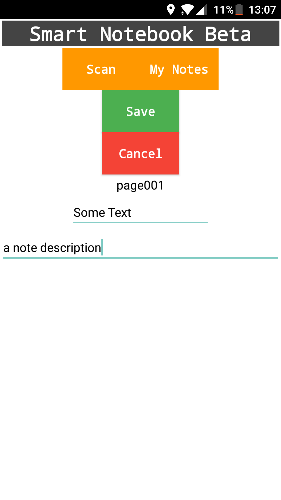

# SmartNotebookBeta

Smart NotebookBeta (Real name comming soon...) is a !Android! notebook/app combo witch uses QR code. Say you write a note on a Post-It note or a white board now simply place one of our QR codes and scan it with the app. Now you can add a title and a description + a image (comming soon) an then you can later on get information from the app or via the QR code.
## Screenshot

# Instructions

1. Download the apk to your computer and transfare it to your phone
You can download the apk form github or from a direct download (Google Drive) By clicking <a href="https://drive.google.com/uc?export=download&id=0B6FSSEN7obfyOFlKMlhwSG5ZOG8"> HERE </a> 
2. Install the apk
3. Run the app.

# Usage Instructoins

1. Scan a code (located on github (master branch))
2. Add a title and a note
3. Save

# Edit a saved note

1. Click on "My notes"
2. Choose the note you want to edit
3. When done click "Save"

# Help develpment

By subbmiting issues and comments on the github page or conatcting us via e-mail:
com.tellspace@gmail.com Thanks!

# Help!

If you have problems contact us at com.tellspace@gmail.com ;D

